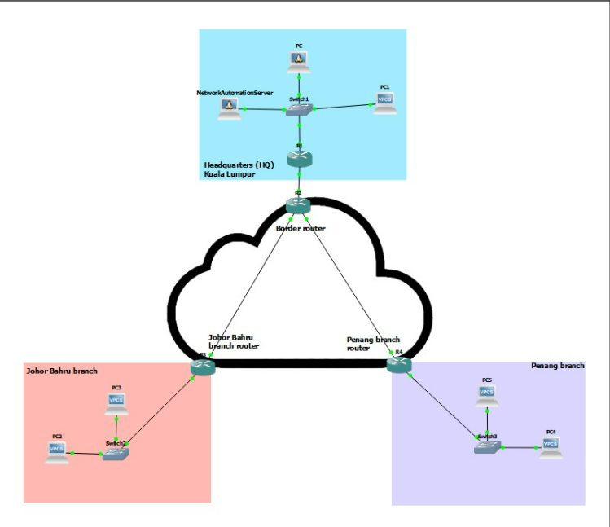

# VPN Network Automation Project Documentation

## 1. Introduction
This project automates the deployment of GRE-based Site-to-Site VPN tunnels
in a hub-and-spoke network topology using Python and Telnet.

## 2. Network Topology
- **R1 (HQ Router)**: Internal services
- **R2 (Transit Router)**: Automation injection point
- **R3 & R4 (Branch Routers)**: Connected via GRE tunnels
- **Automation Server**: Debian Linux running Python scripts

## 3. Project Objectives
- Automate GRE tunnel deployment
- Reduce manual configuration errors
- Implement hub-and-spoke VPN topology
- Test end-to-end connectivity

## 4. Tools and Technologies
- Python 3 (telnetlib)
- GNS3 (Cisco IOS simulation)
- Debian Linux
- GRE tunneling
- Static routing

## 5. Automation Process
1. Debian server pings R1 to check connectivity
2. Connects to R1 via Telnet
3. Chained Telnet access to R2 → R3 & R4
4. Configures GRE tunnels, assigns IPs, enables interfaces
5. Saves configurations using `wr` command
6. Tests connectivity with `ping` and `traceroute`

## 6. Results
- All GRE tunnels active
- Static routes successfully applied
- End-to-end connectivity verified
- Configuration persisted after reboot

## 7. Lessons Learned
- Automation reduces human error and manual effort
- Standardization ensures consistent configurations
- Security: automation injected at border router R2
- Telnet is insecure; SSH is recommended in production

## 8. Future Work
- Use SSH-based libraries (Netmiko) instead of Telnet
- Implement dynamic routing protocols
- Add error handling and logging to the Python script
